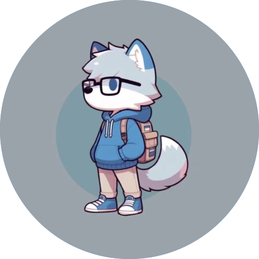

:wave: 你好啊，这里是木诺(NanoMu)，这里暂时还没有任何东西（至少你看不到:stuck_out_tongue_winking_eye:）

<!--
**Nano-Mu/Nano-Mu** is a ✨ _special_ ✨ repository because its `README.md` (this file) appears on your GitHub profile.

Here are some ideas to get you started:

- 🔭 I’m currently working on ...
- 🌱 I’m currently learning ...
- 👯 I’m looking to collaborate on ...
- 🤔 I’m looking for help with ...
- 💬 Ask me about ...
- 📫 How to reach me: ...
- 😄 Pronouns: ...
- ⚡ Fun fact: ...
-->
